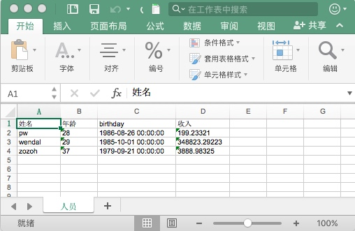
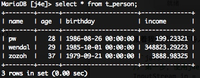

json4excel(简称j4e)
==================================

简介(可用性:生产,维护者:pangwu86)
==================================

[Apache POI](https://poi.apache.org/)项目的封装，简化了一些常见的操作

# 项目的由来

很多项目都有数据导入，导出，或生成各种业务报表的需求，而Excel是其中最常见也最具可读性的格式，所以被广泛使用。

POI封装了对Excel的基本读写操作，j4e是其基础上按照Nutz使用习惯封装了一套常见操作接口，目标就是简化这个操作过程，让我们可以更加专心书写业务代码。

# 重要提示

当前J4E是基于POI3.1.x版本开发的，可以运行在JDK6以上程序中。
POI马上要发布4.0.0版本，仅支持JDK8以上，所以准备当前3.1.x的仅仅维护不再添加新功能

J4E重写的第二个大版本计划于2018年春季放出，基于POI4.0

# 使用手册

## 基本用法

### 定义对象

Excel中的一个Sheet对应Java中的一个POJO对象，导入导出都是以该对象为基础。

比如我们要导出一个表的数据，假如说这个表是Nutz创建的POJO，那么它应该长这样：

```java
@Table("t_person")
public class Person {

    @Name
    private String name;

    private int age;

    private Date birthday;
    
    @ColDefine(type = ColType.FLOAT, width = 20, precision = 5)
    private double income;

    //  下面省略了get set方法，自行脑补

}

```

接着我们要在这个对象上添加一些j4e的配置，这里主要是需要确定sheet名称与列名称

```java
@Table("t_person")
@J4EName("人员")
public class Person {

    @Name
    @J4EName("姓名")
    private String name;

    @J4EName("年龄")
    private int age;

    private Date birthday;
    
    @J4EName("收入")
    @J4EDefine(type = J4EColumnType.NUMERIC, precision = 5)
    @ColDefine(type = ColType.FLOAT, width = 20, precision = 5)
    private double income;

    //  下面省略了get set方法，自行脑补

}
```

### 导出操作

接下来就是导出操作了, 下面的数据库相关操作都以nutz为准，不太熟的可以看下[官网文档](https://nutzam.com/core/dao/hello.html)

```java

// 第一步，查询数据得到一个数据集合
List<Person> people = dao.query(Person.class, null);  
 
// 第二步，使用j4e将数据输出到指定文件或输出流中
try (OutputStream out = new FileOutputStream(Files.createFileIfNoExists2("~/人员.xls"))) {
    J4E.toExcel(out, people, null);  
}
   
```
看看生成的文件




### 导入操作

接着我们再测试下导入，就把刚刚导出的数据直接再写回数据库看看

```java

// 第一步，使用j4e解析excel文件获得数据集合
InputStream in = Files.findFileAsStream(Disks.absolute("~/人员.xls"));
List<Person> people = J4E.fromExcel(in, Person.class, null);

// 第二步，插入数据到数据库
dao.clear(Person.class); 
dao.insert(people);

```
看看数据库里




总的来说只要在POJO对象上设置好相应的注解，excel的导入导出基本上就只需要一行代码即可搞定，是不是很简单呢


## J4E注解详解

### @J4EName

定义在类上就是指定Excel中sheet名，定义在字段上就是指定列名（表头）

### @J4EIgnore

定义在字段上，顾名思义就是被忽略的字段，这字段既不会导入也不会导出

### @J4EDefine

定义在字段上，这个是因为Excel中的类型可能与POJO中的字段类型有差异，需要进行一定的转换操作，所以指明该字段的具体类型可以更加方面的做数据转换。

默认的转换类似为String，也就说不论Excel是什么类型存储的，默认读取出来都是按照String。

像float，double类型的数据，对于数字的精度是有要求的，所以手动指定precision的长度是最好的选择，否者自动转换会出现丢失精度的问题。

像日期时间类型数据，写法更是五花八门了，更是需要我们手动指定导出与导出格式。

目前支持的类型有三种：

```java
public enum J4EColumnType {
    STRING, NUMERIC, DATE
}
```

### @J4EFormat

字符串类型数据适用。

常用于导入数据过程中，对字符串类型数据做一些处理（并不改变导入文件本身数据）。

```java
@J4EFormat(UpperCase = true)     // 全部转换为大写
private String name;
```

```java
@J4EFormat(LowerCase = true)     // 全部转换为小写
private String name;
```

### @J4EDateFormat

日期类型数据使用。

常用于导入数据过程中，转换表格中日期为自己需要的格式。

```java
@J4EDefine(type = J4EColumnType.DATE)
@J4EDateFormat(from = "yyyy-MM-dd HH:mm:ss", to = "yyyyMMdd")
private Date birthday;
```


### @J4EExt

定义在类上，主要是对非标准的表格做一些处理。

比如导出的表格会在头几行写一些别的内容，需要跳过n行或n列才是一个正常的表格。

```java
@J4EExt(passRow = 2)   // 跳过头2两行
public class Person { 
}
```

```java
@J4EExt(passColumn = 2)   // 跳过头2两列
public class Person { 
}
```

## 高级用法

### J4EConf的配置

// 待写

### 按行处理的方式

// 待写

### json作为配置文件

// 待写

# 后续开发计划

// 代写


